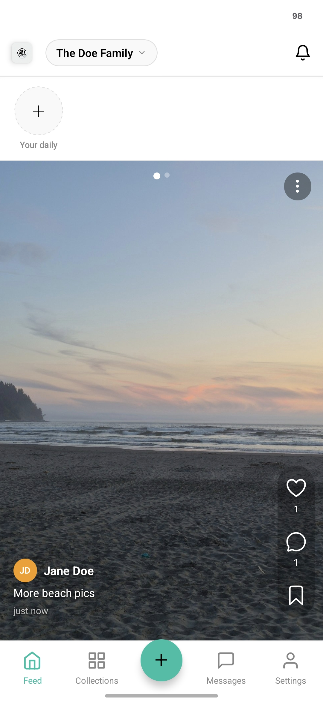
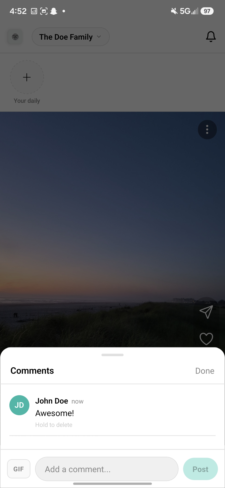
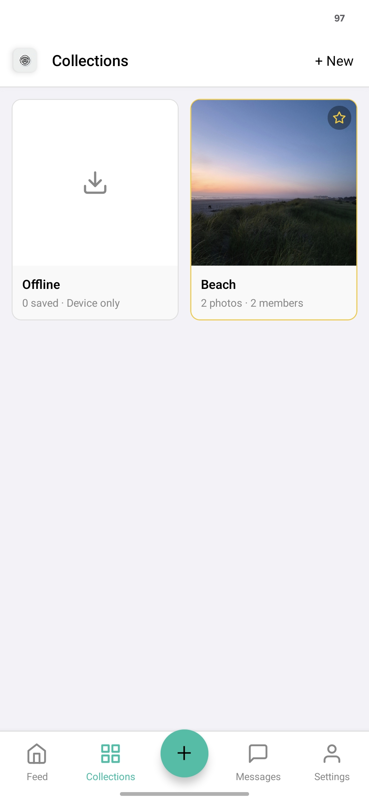
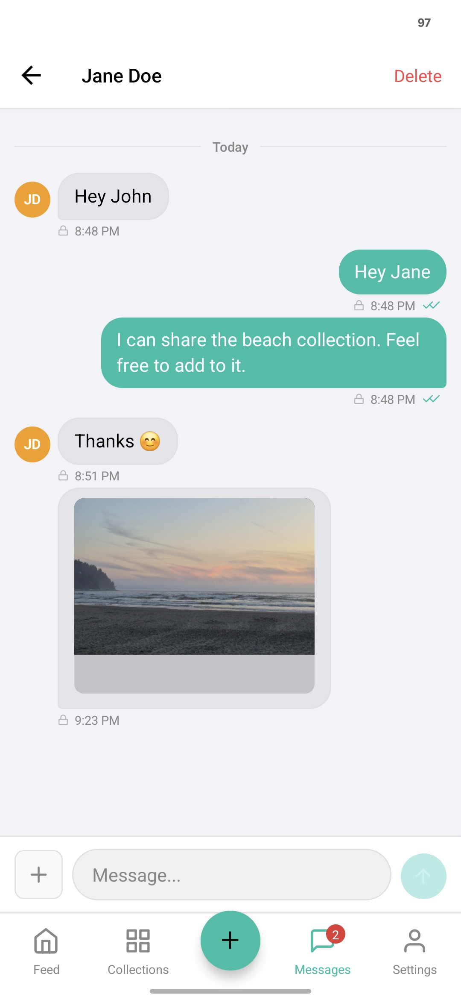
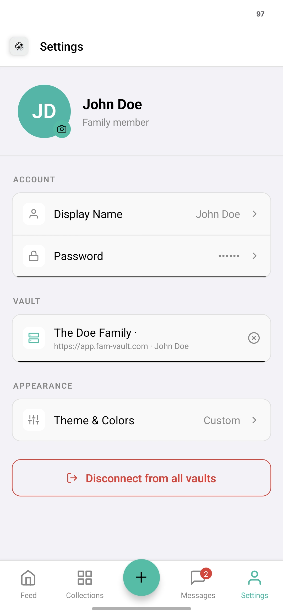
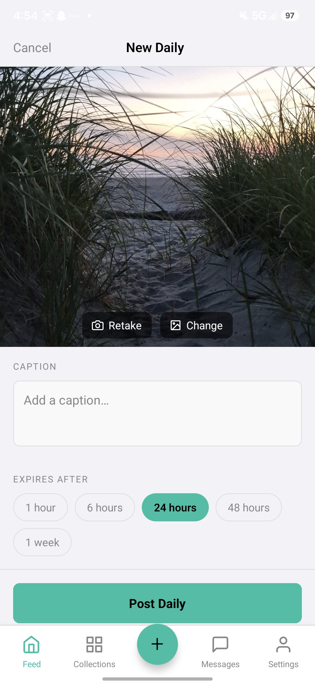
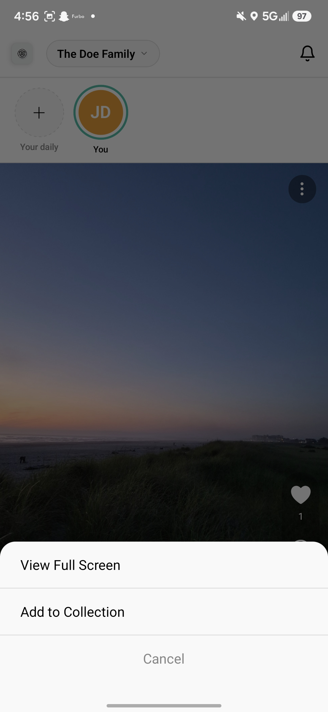
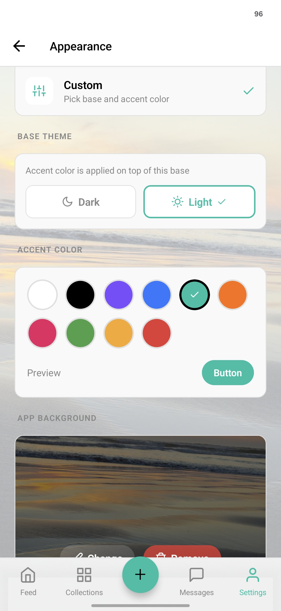
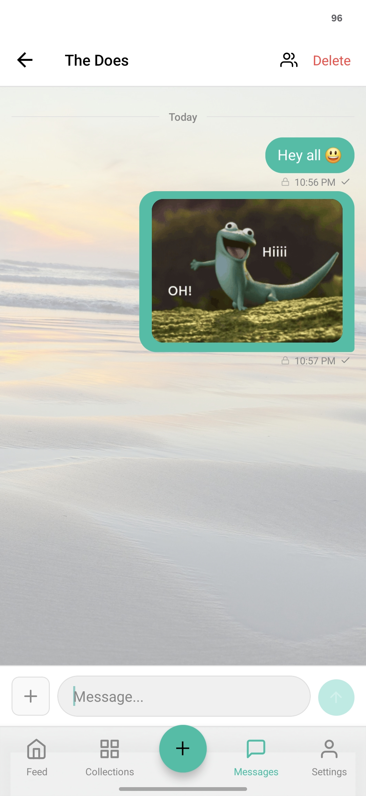
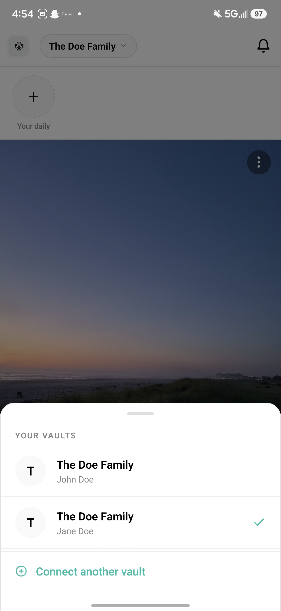

# FamilyVault

<p align="center">
  
  
  
  
</p>

<p align="center">
  A private social media app for families. Photos, videos, stories, and encrypted chat — on hardware you own.
</p>

<br>

<table align="center">
  <tr>
    <td></td>
    <td></td>
    <td></td>
    <td></td>
    <td></td>
  </tr>
  <tr>
    <td></td>
    <td></td>
    <td></td>
    <td></td>
    <td></td>
  </tr>
</table>

<br>

---

## Features

- **Feed** — Full-screen photo and video posts with likes, comments, and saves
- **Dailies** — Disappearing stories with configurable expiry (1 hour to 1 week)
- **Messages** — End-to-end encrypted group chat and DMs with GIF and media support
- **Collections** — Shared photo albums between selected family members
- **End-to-end encryption** — All content encrypted with AES-256-GCM before leaving the device
- **No accounts required** — Join via invite link and QR code, no email or phone number needed
- **Remote access** — Optional Cloudflare Tunnel for access outside your home network
- **Admin panel** — Member management, invite links, and server backups via a local web UI

---

## Download

**Android:** Download the latest APK from the [Releases page](https://github.com/LevyTheDevy/Family-Vault/releases/latest). Enable *Install from unknown sources* in your Android settings, then open the file to install.

**iOS:** See [Building the App](#building-the-app) below.

---

## Quick Start

You need one computer to act as the server — a spare PC, a Raspberry Pi, or any always-on machine. Everyone else just installs the app.

**1. Install Docker Desktop**

- [Windows](https://docs.docker.com/desktop/install/windows-install/)
- [Mac](https://docs.docker.com/desktop/install/mac-install/)
- [Linux](https://docs.docker.com/desktop/install/linux-install/)

Open Docker Desktop and make sure it is running before continuing.

**2. Download FamilyVault**

Click the green **Code** button on this page and select **Download ZIP**. Unzip it somewhere you will remember.

**3. Start the server**

- **Windows:** Double-click `start.bat`
- **Mac / Linux:** Run `./start.sh` in a terminal

The first run takes a few minutes while Docker builds the server. After that it starts in seconds. The admin panel opens in your browser automatically.

**4. Create your admin account**

Set up your admin account in the panel that opens. The admin panel is only accessible on your local network.

**5. Invite your family**

Generate an invite link in the admin panel and share it. Family members scan the QR code in the app to join instantly.

**Stopping and starting**

```bash
docker compose stop      # pause the server
docker compose start     # resume
docker compose down      # stop and remove containers (your data is kept)
```

**Updating**

```bash
docker compose down
docker compose build --no-cache
docker compose up -d
```

---

## Remote Access

By default the server is only reachable on your home network. To allow family members to connect from anywhere:

- **Windows:** Double-click `remote-access.bat`
- **Mac / Linux / Pi:** Run `./remote-access.sh`

The script connects a free [Cloudflare Tunnel](https://cloudflare.com) — paste one command from the Cloudflare dashboard and it handles the rest. Requires a free Cloudflare account and a domain name (~$10/year). Once set up, the tunnel starts automatically with the server.

---

## Raspberry Pi

Docker runs on the Pi out of the box. Install it with:

```bash
curl -fsSL https://get.docker.com | sh
sudo usermod -aG docker $USER
```

Log out and back in, then follow the Quick Start steps above. The Pi is ideal as an always-on server — it draws very little power.

---

## Building the App

Pre-built Android APKs are attached to each [GitHub Release](https://github.com/LevyTheDevy/Family-Vault/releases). For iOS or to build from source:

**Requirements**
- [Node.js](https://nodejs.org/) 18+
- [EAS CLI](https://docs.expo.dev/build/introduction/): `npm install -g eas-cli`
- An [Expo account](https://expo.dev/signup) (free)
- iOS builds require a Mac, Xcode, and an [Apple Developer account](https://developer.apple.com/programs/) ($99/year)

**Android**

```bash
cd app
npm install
eas build --platform android --profile preview
```

**iOS**

```bash
cd app
npm install
eas build --platform ios --profile production
```

**Local build**

```bash
cd app
npm install
npx expo prebuild
```

Then open `android/` in Android Studio or `ios/` in Xcode.

---

## Tech Stack

| Layer | Technologies |
|---|---|
| Server | Node.js, Express, better-sqlite3, Multer, JWT |
| App | React Native, Expo, React Navigation, expo-av |
| Encryption | react-native-quick-crypto (AES-256-GCM, PBKDF2) |

---

## Security

- All messages, captions, comments, photos, and videos are encrypted with AES-256-GCM on-device. The server stores only ciphertext and never sees plaintext content.
- The vault key is derived via PBKDF2-SHA256 and wrapped individually per member with their password. The server never holds the unwrapped key.
- The vault key is stored in each device's secure enclave (Android Keystore / iOS Secure Enclave).
- The admin panel does not expose user content and is never routed through the internet.
- Invite links are single-use and revocable.
- Passwords are hashed with PBKDF2 (100,000 iterations, SHA-256).
- Login attempts are rate-limited per IP.
- Media files require JWT authentication on every request.

To report a vulnerability, see [SECURITY.md](SECURITY.md).

---

## Legal

FamilyVault is a self-hosted tool. The person who deploys the server is solely responsible for all content stored and for compliance with applicable laws (GDPR, CCPA, COPPA, etc.).

Illegal content of any kind is strictly prohibited. CSAM must be reported immediately to [NCMEC](https://www.missingkids.org/gethelpnow/cybertipline) or your country's equivalent authority.

This software is provided as-is with no warranty. See [LICENSE](LICENSE) for full terms.

---

## License

[PolyForm Noncommercial 1.0.0](LICENSE) — free to use, modify, and self-host for personal or non-commercial use. Commercial use is not permitted.
